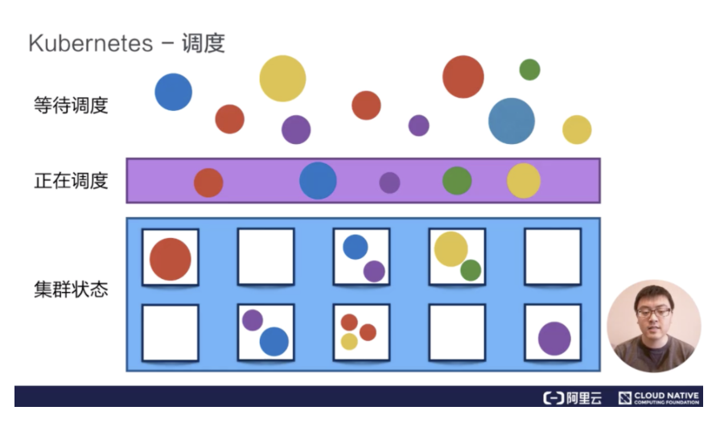
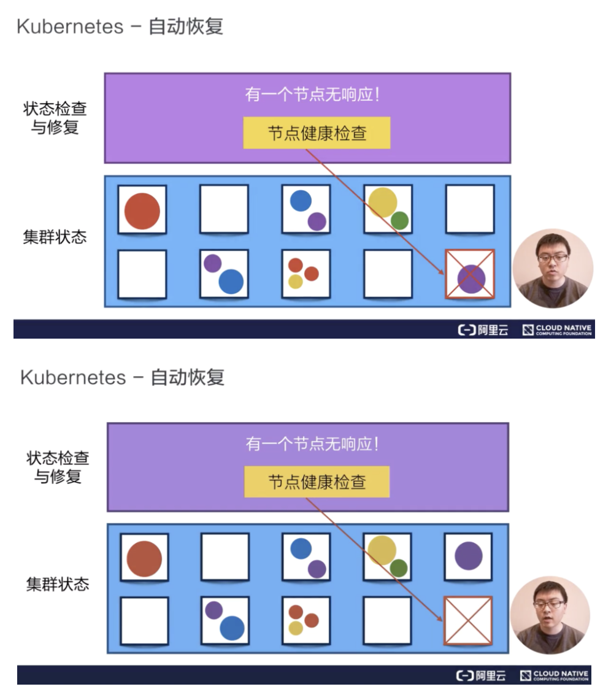
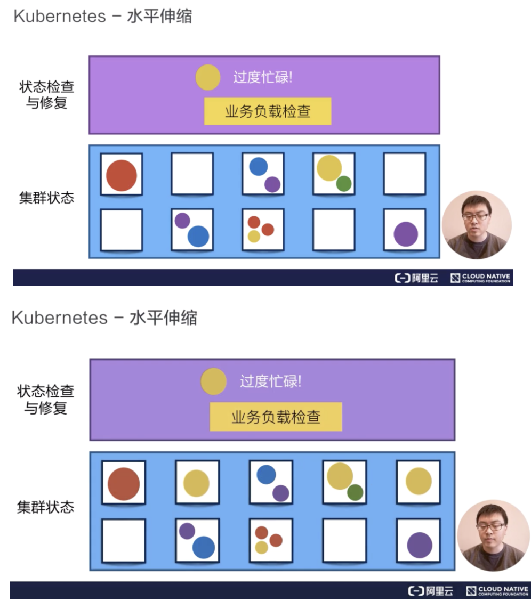

### kubernetes核心功能

- 服务发现与负载均衡。
- 容器自动装箱。也叫做“scheduling”，也就是“调度”。通过观察正在被调度的这个容器所需要的cpu和memory等资源，在集群中找一台相对比较空闲的机器把该容器放置到这台机器上。

- 存储编排。
- 容器自动恢复。Kubernetes有节点健康检查的功能，它会监视这个集群中所有的宿主机，当宿主机本身出现故障，或者软件出现故障的时候，节点检查会自动对他进行发现。kubernetes会把运行在这些失败节点上的容器进行自动迁移，迁移到一台正在健康运行的宿主机上，来完成集群内容器的一个自动恢复。

- 自动发布与回滚。
- 配置密文管理。
- 批量执行。
- 水平伸缩。kubernetes有业务负载检查的能力，它会监测业务上所承担的负载，如果这个业务本身的cpu利用率过高，或者响应时间过长，它可以对这个业务进行一次扩容。
