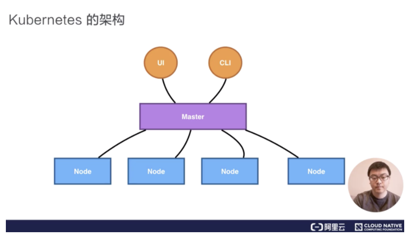
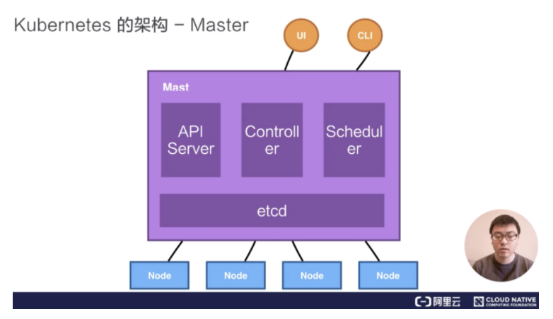
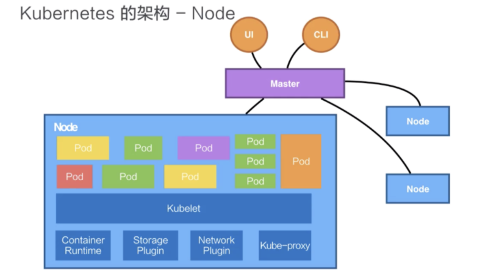
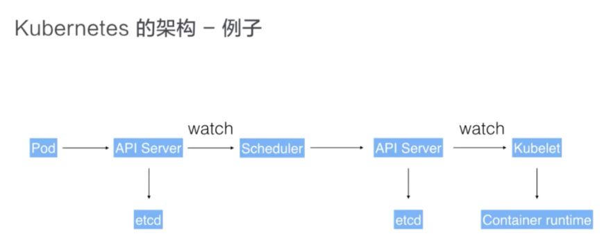

### Kubernetes Components

参考文档： 
https://kubernetes.io/docs/concepts/overview/components/ 
https://kubernetes.io/docs/concepts/overview/kubernetes-api/

- Master组件
  - kube-apiserver：kubernetes中的所有组件都会和API Server进行连接，组件与组件之间一般不进行独立的连接，都依赖于API Server进行消息的传送。
  - kube-controller-manager：控制器，用来完成对集群状态的一些管理。例如，容器自动恢复和水平伸缩，都是通过controller来完成的。
  - cloud-controller-manager：
  - kube-scheduler：调度器。例如，根据容器cpu，memory请求大小，找一台合适的节点，进行放置。
  - etcd：是一个分布式的存储系统，API Server中所需要的源信息都被放置在etcd中，etcd本身是一个高可用系统，通过etcd保证整个kubernetes的Master组件的高可用性。
  

- Node组件
  - kubelet：运行pod的组件。它通过API Server接收到所需要pod运行的状态，然后提交到Container Runtime组件中。
  - kube-proxy：完成service组网的组件。利用iptable的能力来进行组件kubernetes的network，也就是cluster network。
  - container Runtime

- kubernetes架构中的组件，如何进行交互？
  - 用户可以通过 UI 或者 CLI 提交一个 Pod 给 Kubernetes 进行部署，这个 Pod 请求首先会通过 CLI 或者 UI 提交给 Kubernetes API Server
  - API Server 会把这个信息写入到它的存储系统 etcd
  - Scheduler 会通过 API Server 的 watch 或者叫做 notification 机制得到这个信息：有一个 Pod 需要被调度。这个时候 Scheduler 会根据它的内存状态进行一次调度决策，在完成这次调度之后，它会向 API Server report 说：“OK！这个 Pod 需要被调度到某一个节点上。”
  - API Server 接收到这次操作之后，会把这次的结果再次写到 etcd 中。
  - API Server 会通知相应的节点进行这次 Pod 真正的执行启动。
  - 相应节点的 kubelet 会得到这个通知，kubelet 就会去调 Container runtime 来真正去启动配置这个容器和这个容器的运行环境，去调度 Storage Plugin 来去配置存储，network Plugin 去配置网络。

- 插件
  - DNS
  - Dashboard
  - Container Resource Monitoring
  - Cluster-level Logging